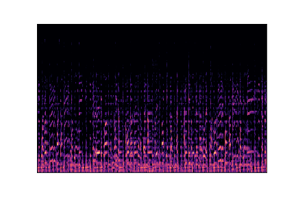
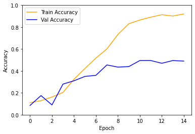

# MVP
## Result

I trained a CNN model that took in spectograms of 30-seconds worth of songs of 10 different genres to classify unseen spectograms by genre. A spectogram is a visual representation of audio that takes into account the time, pitch, and amplitude of sound waves. Below is a spectograph of one of the audio examples:



These images were converted to numpy arrays such that they could be fed into a neural network.

Here is the summary of my CNN:

```
_________________________________________________________________
 Layer (type)                Output Shape              Param #   
=================================================================
 conv2d_42 (Conv2D)          (None, 286, 430, 16)      1312      
                                                                 
 dropout_69 (Dropout)        (None, 286, 430, 16)      0         
                                                                 
 max_pooling2d_39 (MaxPoolin  (None, 143, 215, 16)     0         
 g2D)                                                            
                                                                 
 conv2d_43 (Conv2D)          (None, 141, 213, 32)      4640      
                                                                 
 dropout_70 (Dropout)        (None, 141, 213, 32)      0         
                                                                 
 max_pooling2d_40 (MaxPoolin  (None, 70, 106, 32)      0         
 g2D)                                                            
                                                                 
 flatten_10 (Flatten)        (None, 237440)            0         
                                                                 
 dense_37 (Dense)            (None, 100)               23744100  
                                                                 
 dropout_71 (Dropout)        (None, 100)               0         
                                                                 
 dense_38 (Dense)            (None, 20)                2020      
                                                                 
 dropout_72 (Dropout)        (None, 20)                0         
                                                                 
 dense_39 (Dense)            (None, 10)                210       
                                                                 
=================================================================
Total params: 23,752,282
Trainable params: 23,752,282
Non-trainable params: 0
_________________________________________________________________
```

The results are not great. While the training accuracy continued to rise toward 99+%, the validation and test scores plateaued near 50% despite a lot of modification. Granted, 50% is quite a bit better than random guessing and genres are rather liquid in the first place, I am unsatisfied with the result and will be looking to improve before feeding modern music into the model.



## To-Do
There is still a tremendous amount of work to be done on this project.

- Tweak method of transforming wav files to spectographs to capture more relevant details
- Explore other visualizations of sound files like chromagram, spectral rolloff, spectral centroid, or HPSS
- Use a time-series component like RNN or otherwise find a way to account for tempo (and not have that drive the prediction)

---

While looking up work other people on the internet have done on this dataset, I found their accuracy to be much higher than mine, and spent a while to improve my accuracy. After too long, I finally realized that they were splitting up their 30-second songs into 6 5-second songs apiece in an attempt to increase their sample size. However, what actually happened is that the train-test-val split would split up these samples into different categories. While every 5 second interval of a song may not be identical, it can be pretty similar. Thus, the test and val sets were never truly fully unseen, because the model would in all likelihood have been trained on other parts of those songs.
