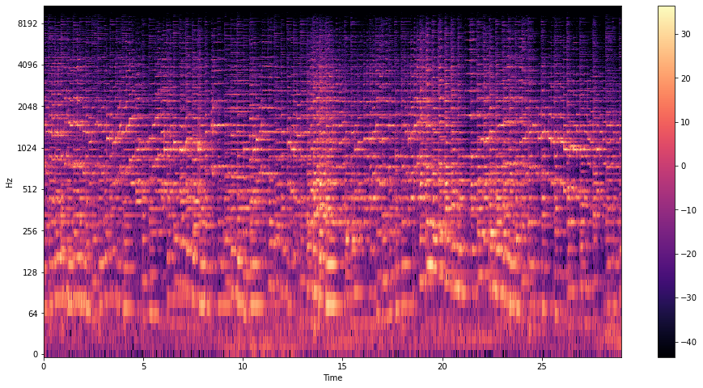
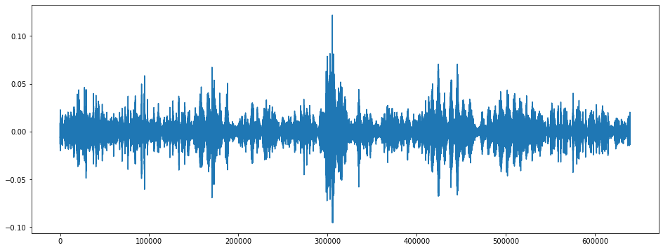
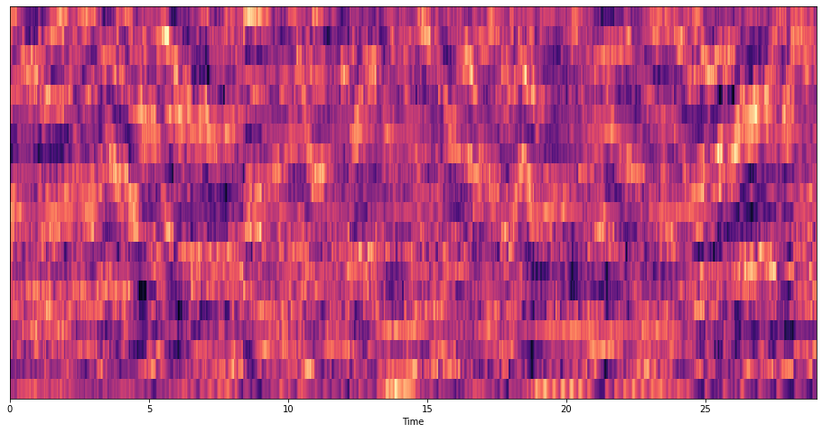
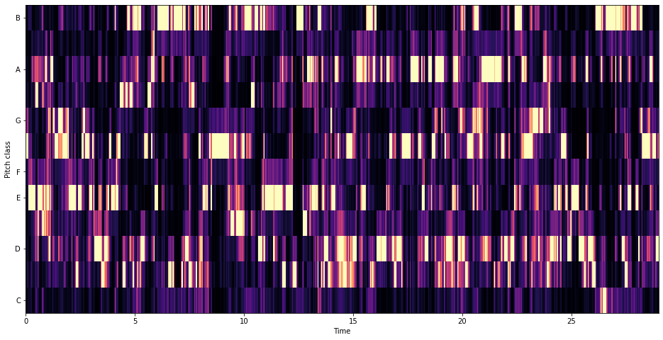

# Using Deep Learning to Track Genre Trends in the Music Industry
## Backgroud
The music industry is, well, <ins>the</ins> music industry, with billions of dollars of revenue per year in the US alone. In order to cater to its audience, music is labeled as being part of a genre such as Pop, Jazz, R&B, Country, Latin, etc. The issue with these classifications is that they are essentially moving targets; what defines a genre in a certain year is prone to change in subsequent years. An example of this is the Michael Jackson hit "Billie Jean", which won a Grammy as an R&B song. Fortunately, these trends are often cyclical and involve movement toward and away from other existing genres. Is this movement predictable? This project aims to break down songs into components of genres using data science, and see if there are any trends that could be insightful.
## Design
This project used the GTZAN dataset for music, which contains 100 audio samples of 10 different music genres, for a total of 1000 examples. Each .wav file can be represented by a single 1D vector that has 22,050 values per second. This project uses the librosa library to convert the 1D vector into 2D vectors with more order to them, which are then read into a convolutional neural network in order to predict the genre based on the original waveform.

*A spectogram of classical.00000.wav (colorized)*

The most useful of the transformations will then have their neural networks merged in order to make a stronger prediction. Part of the original scope of the project was to use the model to distinguish the different influences of the 10 genres from the model on modern music; unfortunately, that aspect was never realized.
## Data
This project used the [GTZAN dataset](https://www.kaggle.com/datasets/andradaolteanu/gtzan-dataset-music-genre-classification) with 100 30-second samples for each of blues, country, classical, disco, hip-hop, jazz, metal, pop, reggae, and rock.

Waveforms were transformed into the following representions:
* Spectogram, which show pitch range density and melodic contour over time
* Percussion, which shows the distribution of sudden changes in volume (percussive sounds) over time, illuminating rhythm and tempo
* MFCC, which is similar to a spectogram but shows the typical range of a human voice to focus on singing
* Chromagram, which shows pitch distribution over time

An example of a spectrogram is above. Below are representations of percussion, MFCC, and chromagram in that order:

## Algorithms
This project built and tested several neural networks, including fully dense, CNN1D, CNN2D, RNN, and LTSM models. The best results were with CNN2D models on the 2D transformations of the waveform. All models featured dropout layers to protect against overfitting. The validation loss was also carefully monitored to determine how many epochs to use; even if the accuracy score was still going up, there was a point where the validation score started to go down.
## Tools
* Keras
* librosa
* numpy and scikitlearn

---

Unfortunately, the result of this project was rather unsatisfactory. The methodology used to achieve the 46% accuracy from the MVP was iterated on, but ultimately the benchmark was not improved upon or even reproduced. The various attempts to merge the neural networks of various transformations produced marks that were only at the same level or lower that the highest-performing transformation, a spectograph. With an accuracy that low, it doesn't make much sense to use the model to make predictions on modern songs.
